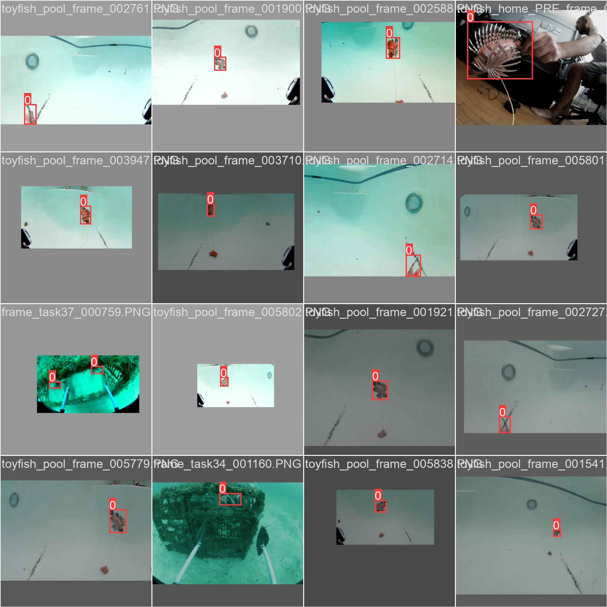
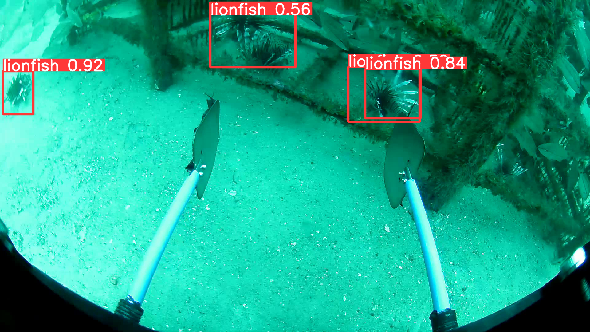
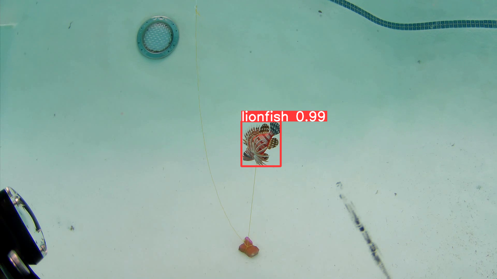

# LionFish-Tracker

Training on Custom Dataset

Following is the Confusion Matrix, The model performed good on test dataset with only 1 False Negative compared to 23 True Positive

Precision = 100
Recall = 95.83

F1 Score

Sample train data

Trained on: NVIDIA GeForce RTX 3060 Laptop GPU

Model performance

